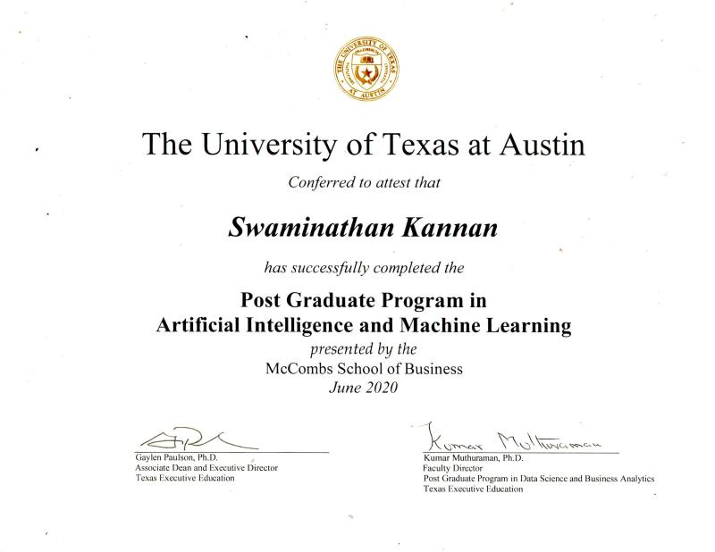
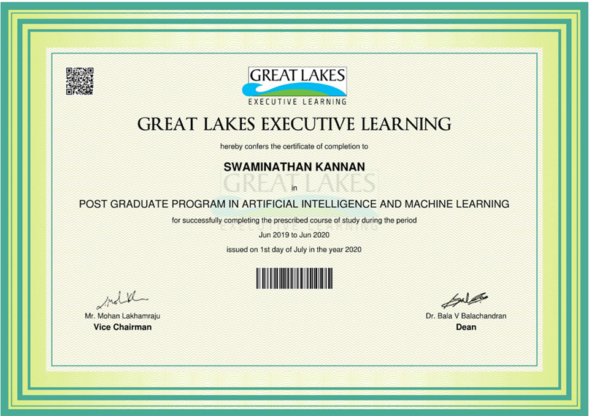
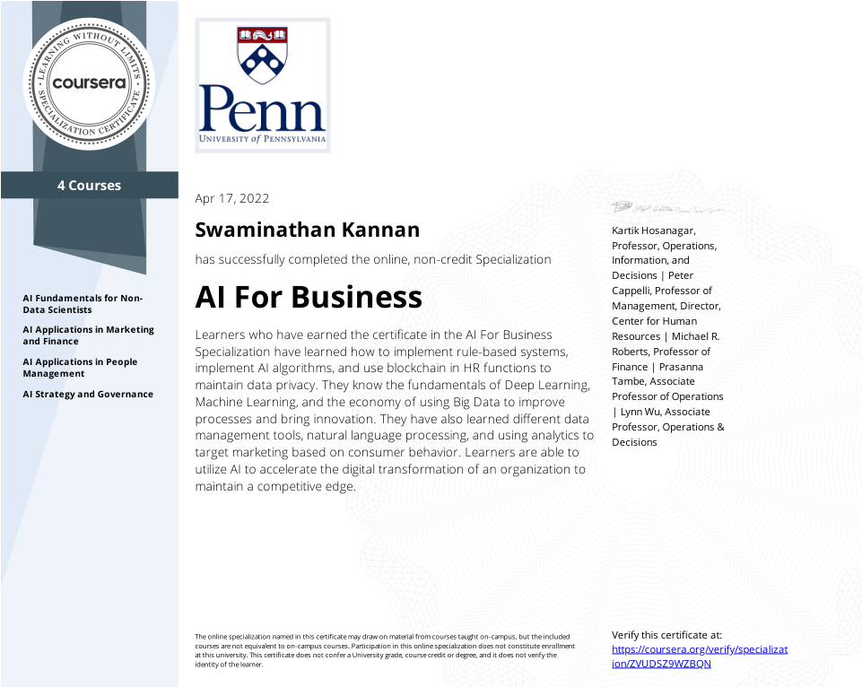
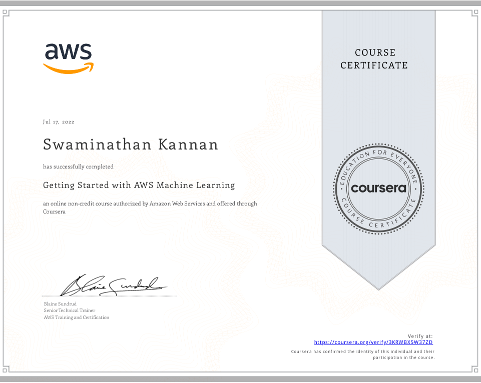
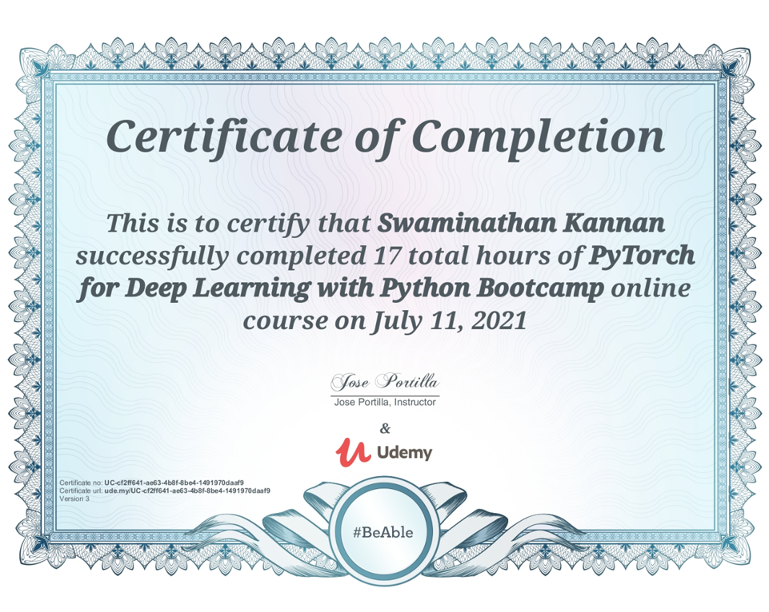
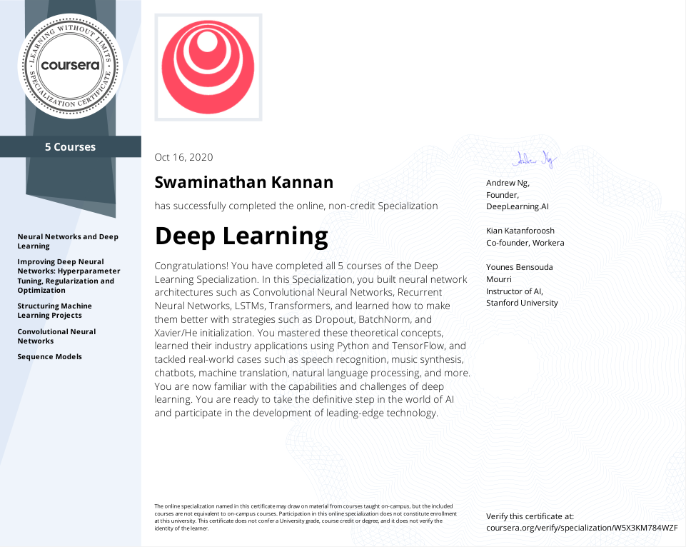
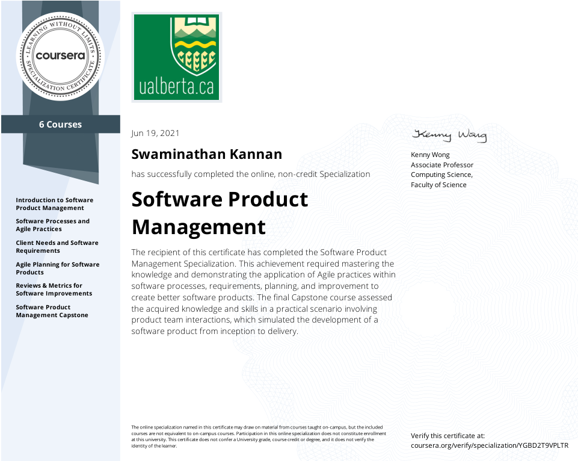

# Certifications
Certificates of Specializations and Courses completed

	

	

## Coursera / Udemy Specializations

<!-- Photo Grid -->

 
  

    
    
    
  

  

	
	
    
  
  
  

	
	
	
  

  

	
    
	
  

For all certificates, please go [here](https://github.com/SwamiKannan/Certifications)
